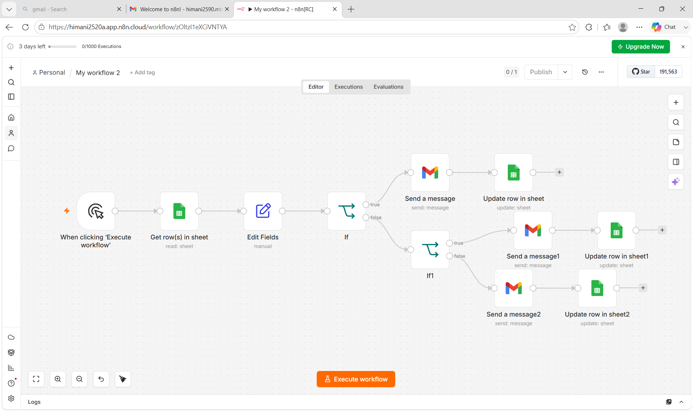
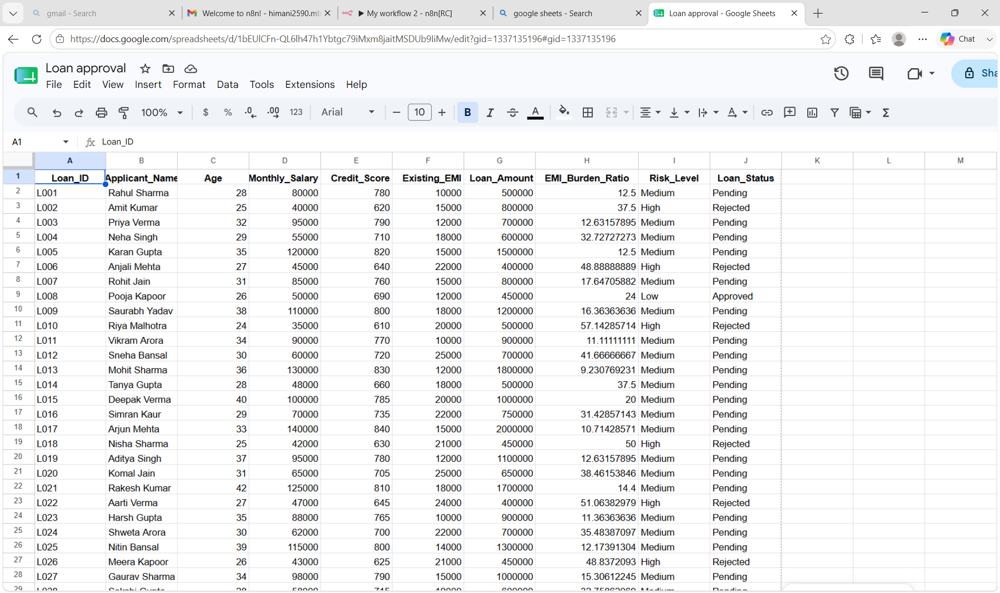
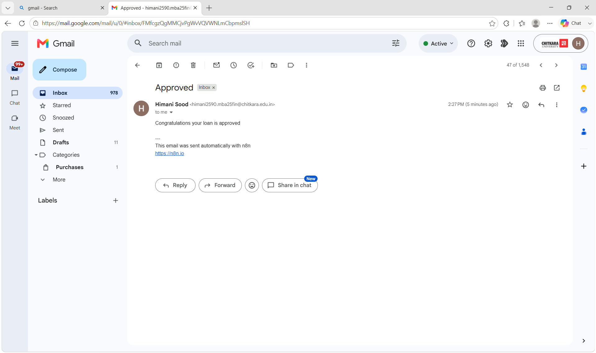
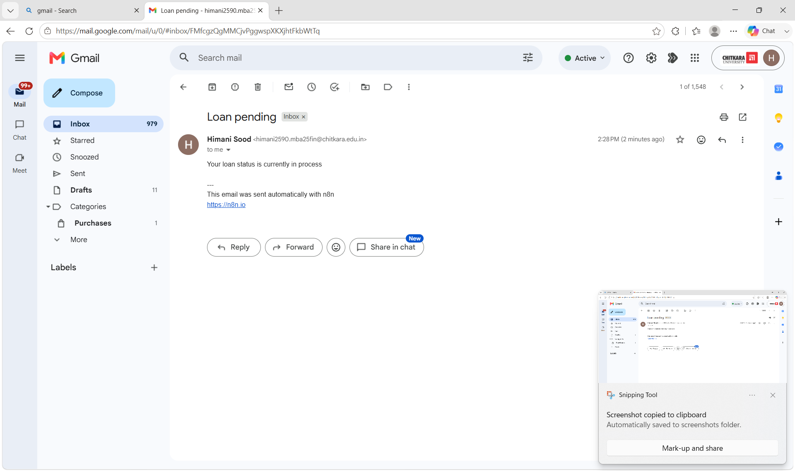
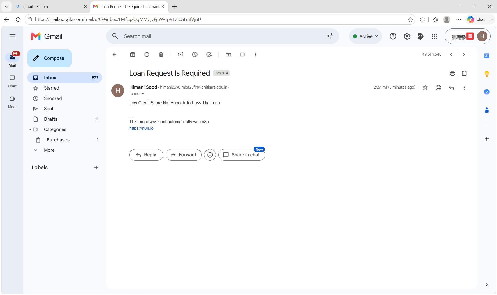

# 🚀 Loan Approval Automation using n8n & AI

## 📌 Project Overview

This project automates the loan approval workflow using **n8n**, **Google Sheets**, and **AI-powered decision-making**. The system processes loan applications, evaluates asset information, and automatically updates approval status while sending alerts for different stages of the workflow.

The goal is to reduce manual effort, improve decision-making speed, and streamline the loan approval process in real time.

---

## 🎯 Features

- ✅ Automated Loan Request Processing
- ✅ Asset Verification Workflow
- ✅ AI-Based Approval Decision Logic
- ✅ Google Sheets Integration
- ✅ Real-Time Status Updates
- ✅ Approval Alerts & Notifications
- ✅ Pending Asset Alerts
- ✅ Missing Information Detection
- ✅ End-to-End Workflow Automation using n8n

---

## 🛠️ Technology Stack

| Technology | Purpose |
|------------|----------|
| n8n | Workflow Automation |
| Google Sheets | Data Storage & Tracking |
| AI Logic | Loan Evaluation |
| Webhooks | Trigger Workflow |
| Notification System | Alerts & Updates |

---

## 🔄 Workflow Process

1. Loan application is submitted.
2. Application data is stored in Google Sheets.
3. Asset details are verified.
4. AI evaluates the application based on predefined rules.
5. Decision is generated:
   - Approved
   - Pending Asset Verification
   - Additional Information Required
6. Status is updated automatically.
7. Alerts are sent to relevant stakeholders.

---

## 📂 Repository Structure

---

## 📸 Workflow Screenshots

### n8n Workflow

### Google Sheet Database

### Approval Alert

### Pending Asset Alert

### Additional Information Required

---

## 💡 Business Benefits

- Faster loan processing
- Reduced manual intervention
- Improved operational efficiency
- Real-time monitoring
- Consistent decision-making
- Scalable workflow automation

---

## 🚀 Future Enhancements

- Credit Score Integration
- Banking API Integration
- Fraud Detection Module
- Customer Dashboard
- Email & WhatsApp Notifications
- Machine Learning Based Risk Assessment

---

## 👤 Author

**Himani Sood**

GitHub: https://github.com/himanisood1357-rgb

---

## 📜 License

This project is created for educational and demonstration purposes.
